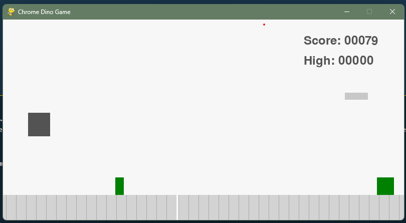

# 🦖 Chrome Dino Game + DQN Agent  

A clone of the classic **Chrome Dino game** with a **Deep Q-Network (DQN)** agent that learns to play autonomously.  

## 🎮 Game Preview  
  


## 🚀 Features  
- Clone of the Chrome Dino game (jump, duck, run actions).  
- DQN agent with **experience replay** and **target network updates**.  
- State representation: **stacked grayscale frames**.  
- Reward function encourages survival, penalizes collisions.  
- Training with ε-greedy exploration.  

## 📦 Installation  
```bash
git clone https://github.com/oussamaF01/Dino_ai_game
cd Dino_ai_game
pip install -r requirements.txt
